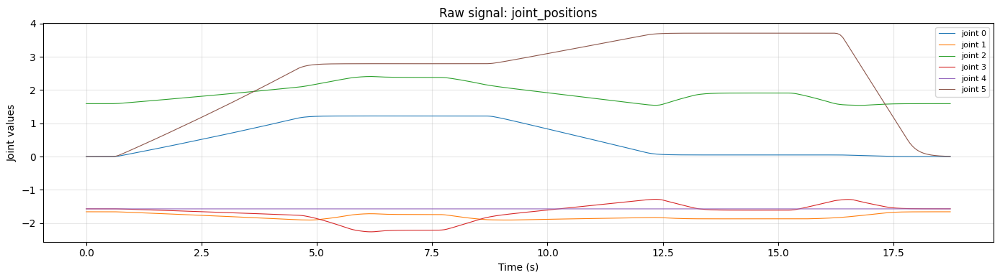
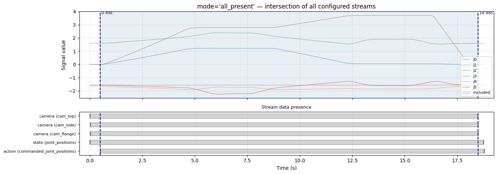
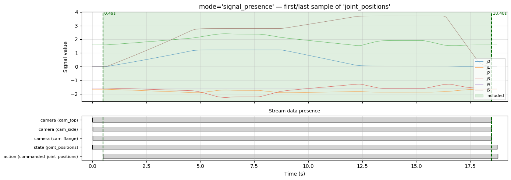
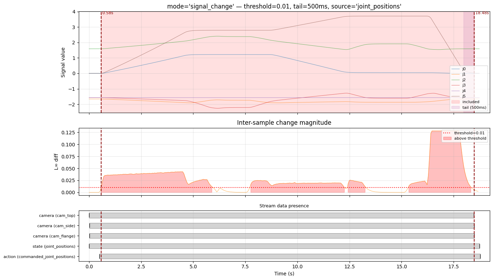
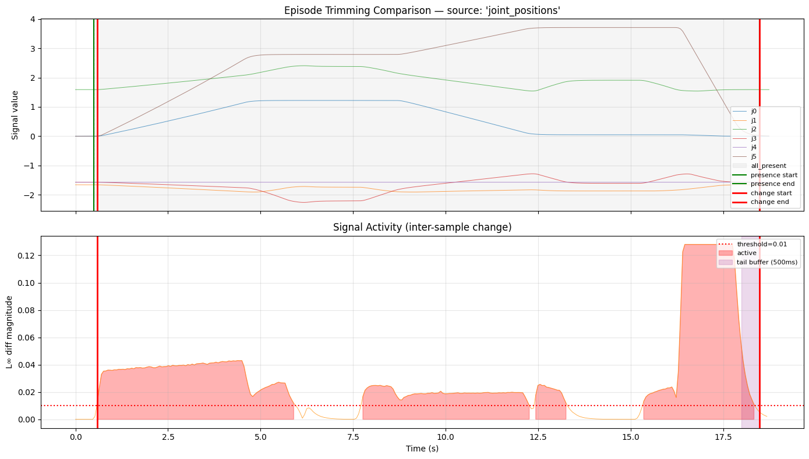

# Export guide

How to turn recorded `.rrd` files into a training dataset, and how each config
field shapes the result.

## Pipeline in one picture

```
.rrd recordings ──▶ EpisodeSampler ──▶ export head ──▶ dataset
                    (trim + resample     (lerobot_v3 /   (Parquet + MP4
                     to fixed FPS)        groot)          + metadata)
```

Each recording segment becomes one **episode**. Within an episode the sampler
builds a fixed-rate time grid, samples the nearest video frame per camera, and
fills action/state at each grid time. The export head then serializes those
samples into the target format.

You drive the whole thing with one JSON config:

```bash
uv run nova-data-cli \
    --dataset ./recordings/pick-and-place-demo \
    --config examples/lerobot_export.json \
    --output ./exports/pick-and-place
```

## Config reference

| Field              | Type                        | Default          | What it does                                                                                                                                                                                |
| ------------------ | --------------------------- | ---------------- | ------------------------------------------------------------------------------------------------------------------------------------------------------------------------------------------- |
| `format`           | `"lerobot_v3"` \| `"groot"` | `lerobot_v3`     | Target dataset format. See [Formats](#formats).                                                                                                                                             |
| `fps`              | int (1–250)                 | `15`             | Fixed frame rate the data is **resampled** to. Every stream is aligned onto a grid at this rate. Higher = more frames, larger dataset; it does not create information that wasn't recorded. |
| `index_column`     | string                      | `canonical_time` | The Rerun timeline used to build the time grid. `canonical_time` is the synchronized clock the collector writes; only change it if you know another timeline is better aligned.             |
| `action`           | list[str]                   | `[]`             | Recording source(s) forming the **action** vector, concatenated in order. See [Sources](#sources-action-state-cameras).                                                                     |
| `state`            | list[str]                   | `[]`             | Source(s) forming `observation.state`, concatenated in order. May be empty.                                                                                                                 |
| `cameras`          | list[object]                | `[]`             | Camera streams → `observation.images.<source>`. Each may set `width`/`height` to resize. See [Cameras](#cameras--resizing).                                                                 |
| `trimming`         | object                      | `all_present`    | How episode start/end bounds are chosen. See [Trimming](#trimming-the-important-part).                                                                                                      |
| `task_description` | string                      | `"task"`         | Natural-language task label written to every frame.                                                                                                                                         |
| `dataset_id`       | string                      | `nova/dataset`   | Dataset identifier — the LeRobot `repo_id` (also used for viz and Hugging Face push).                                                                                                       |
| `version`          | int                         | `1`              | Config schema version. Leave at `1`.                                                                                                                                                        |

## Formats

- **`lerobot_v3`** — a LeRobot v3.0 dataset (Parquet + MP4 + metadata). Use this
  for LeRobot training/tooling.
- **`groot`** — writes the same v3.0 dataset plus `meta/modality.json`, then
  automatically converts it to the **LeRobot v2.1** layout NVIDIA Isaac GR00T
  expects. This runs a separately-pinned converter (needs `uv` + `ffmpeg`); see
  [`tools/groot_lerobot_conversion/`](../tools/groot_lerobot_conversion/README.md).
  The original v3.0 dataset is preserved alongside with a `_v3.0` suffix.

## Sources: action, state, cameras

`action` and `state` are **lists of recording source names**. Listed sources are
concatenated, in order, into a single flat vector per frame:

```json
"action": ["actions_target"],
"state":  ["joint_positions", "gripper"]
```

→ `observation.state` is `[…joint_positions…, gripper]` for every frame.

Two rules worth knowing:

- **Action must be a single, constant-width vector.** Every episode must produce
  the same action dimension, so a source must be present (and same length) at
  every sampled step. The first `action` source also drives the sampling cadence.
- **LeRobot needs at least one camera.**

## Cameras & resizing

Each camera maps to `observation.images.<source>`. By default frames are exported
at their native resolution. Set `width` and `height` (both, > 1) to resize —
independently per camera:

```json
"cameras": [
  { "source": "cam_flange", "width": 224, "height": 224 },
  { "source": "cam_top" }
]
```

Here `cam_flange` is scaled to 224×224 and `cam_top` is left at native size. This
is a **resize** (rescale of the whole frame), not a crop. Smaller frames mean
smaller datasets and faster training input; pick the resolution your policy
expects. See [`examples/lerobot_export_resized.json`](../examples/lerobot_export_resized.json).

## Trimming (the important part)

A raw recording usually has dead time — the robot sits idle before the task
starts and after it ends, and different streams begin/stop at slightly different
moments. Trimming picks the useful `[start, end]` window for each episode.

The figures below come from a real recording of a 6-joint arm (`joint_positions`)
over ~18.7 s.



Trimming can only **narrow** the window — it always stays within the intersection
of the streams that actually have data (action, cameras, state). So the trimmed
range is `intersection ∩ trimming`.

### `all_present` (default)

Uses the intersection of all configured streams, with no extra trimming. Safe and
predictable: you get every frame where _all_ your action/state/camera streams have
data. Good default; keeps lead-in/idle time if the robot was streaming.



```json
"trimming": { "mode": "all_present" }
```

### `signal_presence`

Trims to the **first and last non-null sample** of one named `source`. Use when a
particular signal marks the meaningful span (e.g. a teleop stream that only
publishes while the operator is active).



```json
"trimming": { "mode": "signal_presence", "source": "commanded_joint_positions" }
```

`source` is required for this mode.

### `signal_change`

Trims to the **first and last moment the signal actually moves** — the tightest
option, ideal for cutting idle time at both ends. Change is measured between
consecutive samples (the **L∞ norm** — the largest per-dimension change for a
vector like joint positions), and compared against `threshold`.



The middle panel shows the inter-sample change magnitude against the `threshold`
line; the episode is trimmed to where activity crosses it. `tail_ms` adds a buffer
after the last detected change so the settle/release at the end isn't clipped.

```json
"trimming": {
  "mode": "signal_change",
  "source": "joint_positions",
  "threshold": 0.01,
  "tail_ms": 500
}
```

`source` is required. `threshold` must be > 0; `tail_ms` ≥ 0.

**Tuning `threshold`.** It trades tightness against safety, and the right value
depends on the signal's units and noise floor:

| `threshold`           | Effect on this recording                                                                            |
| --------------------- | --------------------------------------------------------------------------------------------------- |
| `0.001–0.01`          | Full motion captured (~17.9 s) — picks up the very first small move.                                |
| `0.05–0.1`            | Aggressively tight (~2 s) — only the largest motion survives; small approach/retreat moves are cut. |
| too high (e.g. `0.5`) | **No** change exceeds it → trimming is skipped and the range falls back to `all_present`.           |

Start at `0.01` and raise it only if idle time is leaking in; if episodes come out
suspiciously short, your threshold is above the real motion and should come down.

### Modes compared



Same recording, all three modes overlaid with the activity trace. `all_present`
and `signal_presence` keep the full stream span here; `signal_change` tightens
onto the actual motion.

## Choosing settings — quick heuristics

- **Just want everything recorded?** `all_present` (default).
- **A signal cleanly brackets the task?** `signal_presence` on that source.
- **Need to cut idle lead-in/out automatically?** `signal_change` on a motion
  signal (e.g. `joint_positions`), `threshold` ≈ `0.01`, `tail_ms` ≈ `500`.
- **Dataset too big / training input smaller?** Set camera `width`/`height`.
- **Targeting GR00T?** `"format": "groot"` — conversion runs automatically.